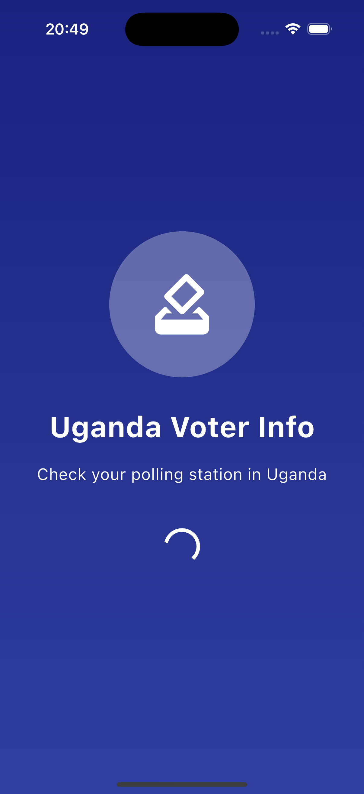
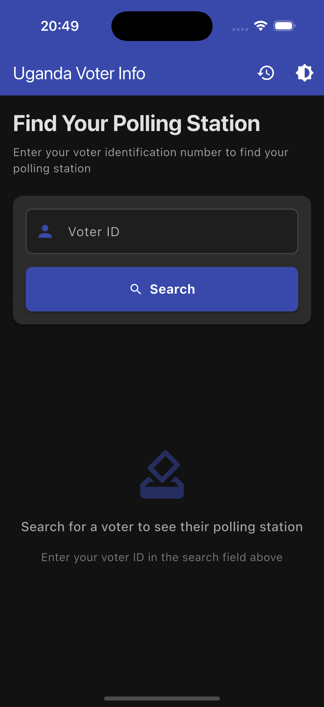
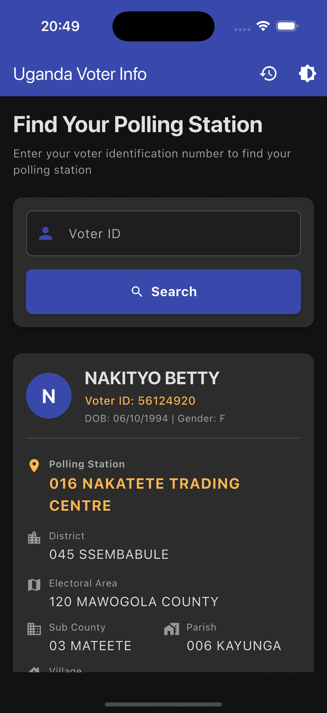
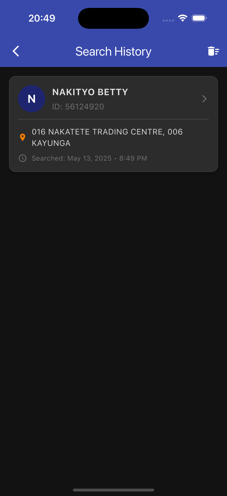

# Uganda Voter Info

A Flutter application that allows Ugandan voters to check their polling station information easily.

## Features

- **Voter Search**: Search for voter information using a valid voter ID
- **Polling Station Details**: View complete polling station and voter information
- **Search History**: Save and access previous search results
- **Sharing Functionality**: Share voter information easily with others via messaging apps, email, etc.
- **Offline Support**: Access previously searched information without internet
- **Dark Mode**: Enhanced dark theme with improved visibility
- **Platform Support**: Works on Android, iOS, and Web
- **Elegant UI**: Modern, clean interface with smooth animations

## Screenshots

<table>
  <tr>
    <td></td>
    <td></td>
    <td></td>
    <td></td>
  </tr>
</table>

## Project Structure

```
lib/
  ├── core/                  # Core functionality
  │   ├── constants/         # App-wide constants
  │   ├── models/            # Data models
  │   ├── services/          # API and storage services
  │   ├── theme/             # App theming
  │   └── utils/             # Utilities and helpers
  ├── features/              # Feature-based modules
  │   ├── splash/            # Splash screen
  │   ├── home/              # Home screen with search
  │   └── history/           # Search history screen
  ├── widgets/               # Reusable widgets
  ├── main.dart              # Entry point
  └── app.dart               # App configuration
```

## Getting Started

### Prerequisites

- Flutter SDK (2.10.0 or higher)
- Dart SDK (2.16.0 or higher)
- Android Studio / VS Code with Flutter extensions

### Installation

1. Create a new Flutter project:

```bash
flutter create --org com.iden uganda_voter_info
```

2. Replace the generated code with the source code from this repository.

3. Update the dependencies in `pubspec.yaml`:

```yaml
dependencies:
  flutter:
    sdk: flutter
  provider: ^6.0.5
  http: ^0.13.5
  shared_preferences: ^2.1.0
  intl: ^0.18.0
  share_plus: ^7.2.1
  cupertino_icons: ^1.0.5

dev_dependencies:
  flutter_test:
    sdk: flutter
  flutter_lints: ^2.0.1
```

4. Create the necessary directories for assets:

```bash
mkdir -p assets/images
```

5. Install dependencies:

```bash
flutter pub get
```

6. Update the API endpoint in `lib/core/constants/api_constants.dart` with your API URL and key.

7. Run the app:

```bash
flutter run
```

## API Integration

The app integrates with a voter information API that requires authorization. The API endpoints are:

### Get Voter Information

```
GET /api/voter/{voterId}
```

**Headers:**
- `Authorization: Bearer your-secret-api-key`

**Response (Success):**
```json
{
  "status": "success",
  "data": {
    "names": "VOTER NAME",
    "dateOfBirth": "DD/MM/YYYY",
    "gender": "M/F",
    "voterIdentificationNumber": "12345678",
    "village": "VILLAGE NAME",
    "district": "DISTRICT CODE AND NAME",
    "electoralArea": "ELECTORAL AREA CODE AND NAME",
    "subCounty": "SUB COUNTY CODE AND NAME",
    "parish": "PARISH CODE AND NAME",
    "pollingStation": "POLLING STATION CODE AND NAME"
  },
  "source": "cache/db"
}
```

**Response (Error):**
```json
{
  "status": "error",
  "message": "No voter found with provided details"
}
```

## Building for Deployment

### Android

```bash
flutter build apk --release
```

The APK file will be available at `build/app/outputs/flutter-apk/app-release.apk`.

### iOS

```bash
flutter build ios --release
```

Open the generated Xcode project and deploy through Xcode.

### Web

```bash
flutter build web --release
```

The built web app will be available in the `build/web` directory.

## Implementation Notes

### Voter ID Format

Voter IDs follow the format: CF + 9 digits + 2 letters + 3 letters (e.g., CF82039109DWCK).

### State Management

The app uses Provider for state management, with a clean architecture approach:

- **Models**: Data structures that represent domain entities
- **Services**: API and storage logic
- **Providers**: Manage state and business logic
- **UI**: Presentation layer that consumes providers

### Local Storage

The app uses SharedPreferences to store search history locally. This allows users to access previously searched voter information without an internet connection.

## Customization

### Changing Theme Colors

To modify the app's theme colors, update the constants in `lib/core/theme/app_theme.dart`:

```dart
// Colors
static const Color primaryColor = Color(0xFF1A237E); // Deep Blue
static const Color secondaryColor = Color(0xFFFF6F00); // Amber
```

### Modifying API Endpoint

To change the API endpoint, update the values in `lib/core/constants/api_constants.dart`:

```dart
static const String baseUrl = 'http://your-api-url.com';
static const String voterEndpoint = '/api/voter/';
static const String apiKey = 'your-secret-api-key';
```

## Contributing

1. Fork the repository
2. Create your feature branch: `git checkout -b feature/my-new-feature`
3. Commit your changes: `git commit -m 'Add some feature'`
4. Push to the branch: `git push origin feature/my-new-feature`
5. Submit a pull request

## License

This project is licensed under the MIT License - see the LICENSE file for details.

## Acknowledgements

- Flutter team for the amazing framework
- Provider package for state management
- Uganda Electoral Commission for voter information